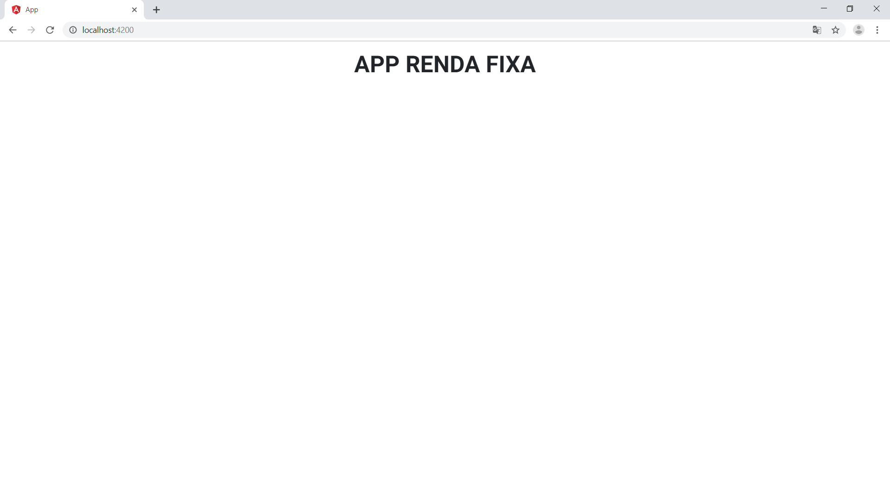

# App Renda Fixa

Projeto proposto pelo App Renda Fixa

Desenvolvido com Angular 8.2.* e MDBootstrap 8.1.*

## Requisitos

  * GIT
  * Node

Instale os programas acima listados. 

## Configuração do repositório e dependências

Utilizando o Git, siga os passos abaixo para configuração desse projeto:

### Clone esse repositório

```bash
git clone https://github.com/feeh27/app-renda-fixa
```

### Instale as dependências com npm

```bash
cd app-renda-fixa
npm install
```

### Inicie o servidor e verifique se está tudo funcionando

```bash
ng serve --open
```

#### Resultado esperado


